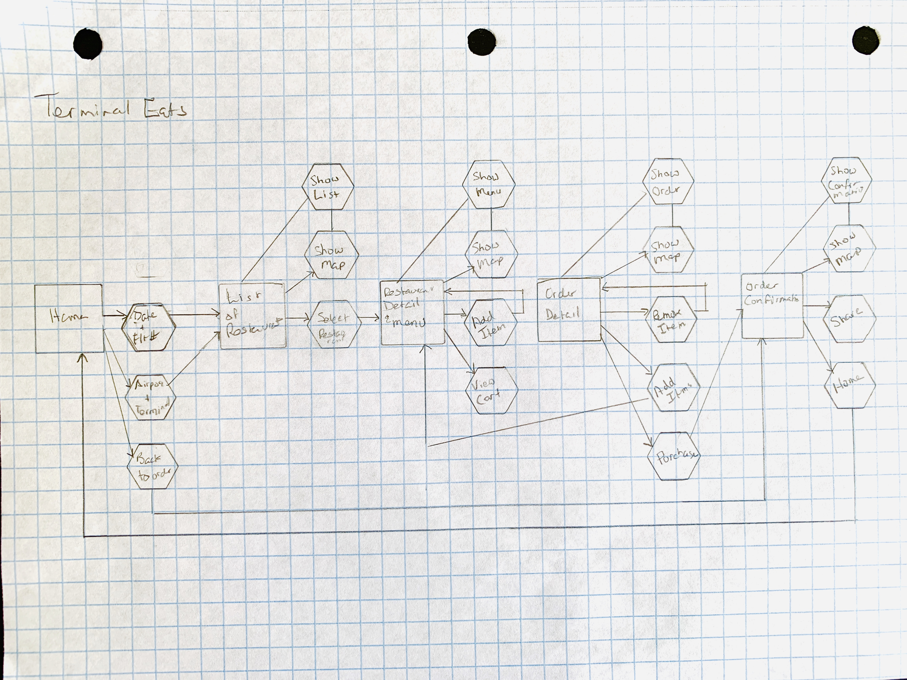
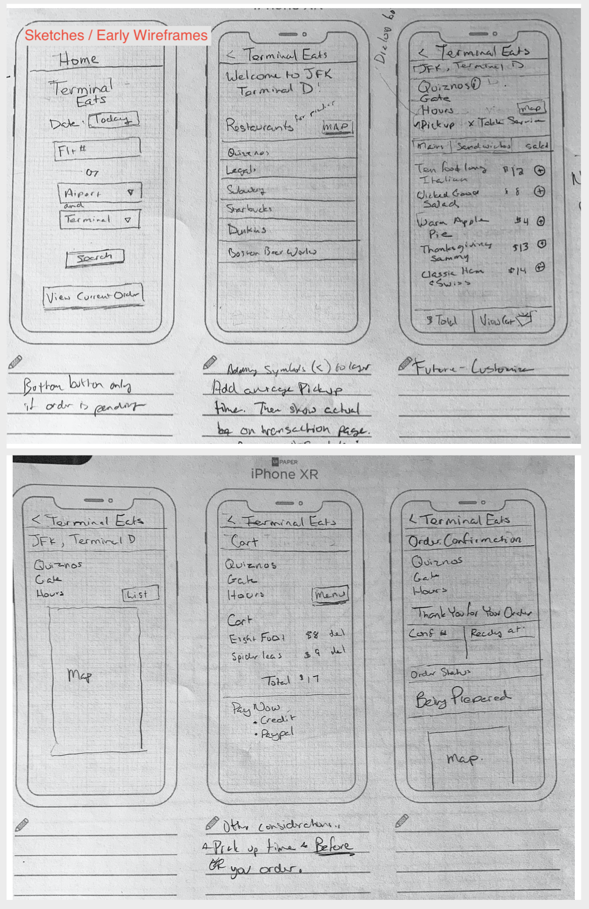
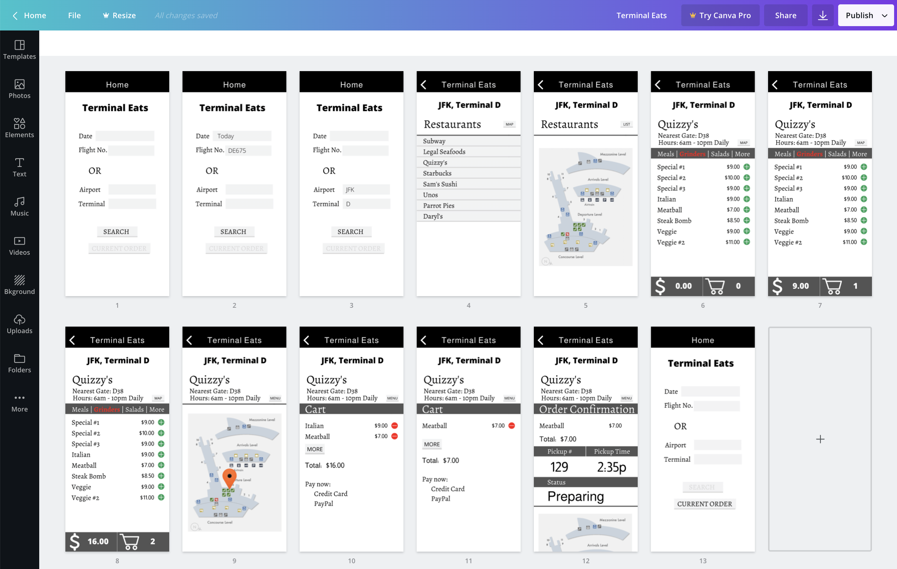
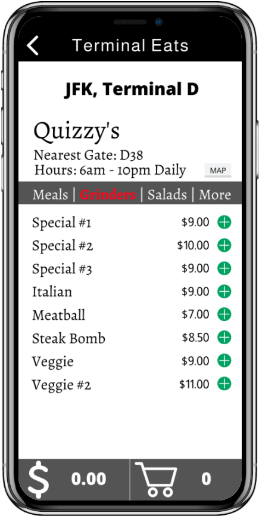
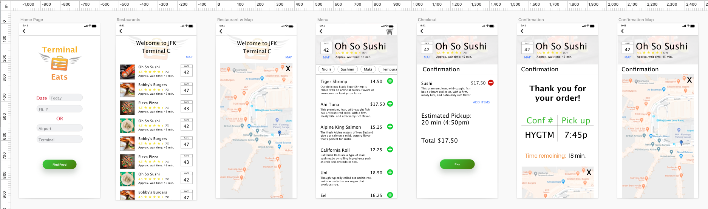
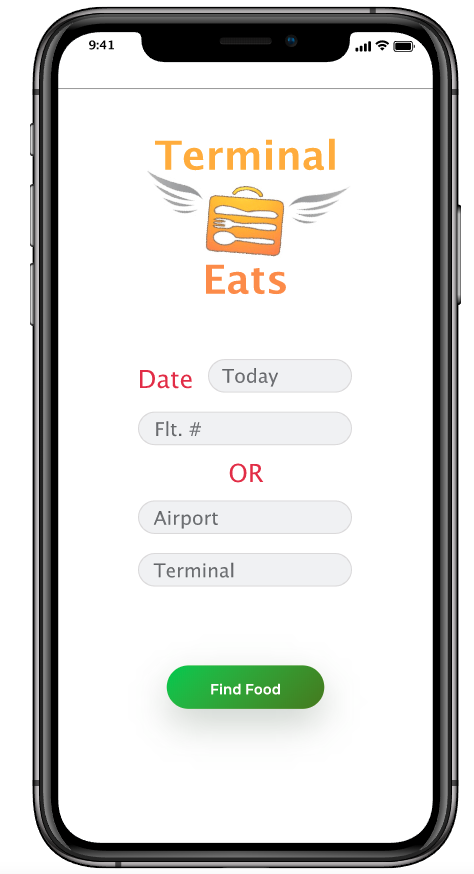

# UX Project - Terminal Eats

Starving, in line at security, and cutting it close to departure? Terminal Eats helps you find restaurants in your terminal, check prep times, and place an order for pickup, so you can board your flight hot meatball sub in hand!

Terminal Eats is an independent project (not based on a tutorial). It is an opportunity for me to apply lessons in UX tools, and an excuse to just try things out!

Tools: Invision, Sketch, Atom, Marvel, Canva, Pencil, Paper, and Persistence

Takeaway: Damn, I love this stuff!

## Prep and Planning

Workflow Spec

Tools: Graph paper, pencil

Takeaways: Drawing the workflow diagram forces decisions about the app's functionality and making sure they support the app's goals.

Wireframes

Tools: iPhone 10 templates, pencil, eraser

Takeaways: The wireframe brings life to the workflow diagram. Creative thinking is required to accommodate the functional demands while keeping the interface attractive and intuitive.

Mockup (Canva)

Tools: Canva, ctrl+c, ctrl+v (repeat)

Takeaways: Canva is limited for working across multiple artboards, as changes do not propagate through the design. I (later) found using symbols in Sketch to be more flexible and efficient.

## Prototypes

Prototype v.1

Tools: Marvel

Takeaways: Reviewing the hotspot map is a great opportunity to compare the mockups with the workflow diagram to make sure the app will function as planned.

Prototype v.2 (Marvel)

Tools: Marvel

Takeaways: Sometimes despite sweat and tears a project just doesn't work out. But I learned so much in the effort, and looking back on this project, seeing how far I've come, is a great morale booster.

<a href="https://marvelapp.com/22c4fieg/screen/68000084" target="_blank">First Prototype

</a>

Prototype Mockup (Sketch)

Tools: Sketch

Takeaways: Symbols and libraries are amazing. My Sketch course emphasized efficiencies like properly using symbols and (many) keyboard shortcuts.

</a>

Final Prototype

Tools: Invision

Takeaways: Managing file structures and naming conventions is essential for working on imported Sketch files in Invision, something I will account for in future project planning.

Other takeaway: It's time to move on. Nothing is ever perfect, never done. What's important is to recognize when something more important has come along. I really could work on this app forever, but my idea for a CSPAN app (yes, really) is calling to me… and it's time to learn Adobe XD.

Hop straight to "Find Food." You are dying for Ahi Tuna from Oh So Sushi... don't forget to checkout the map! 

